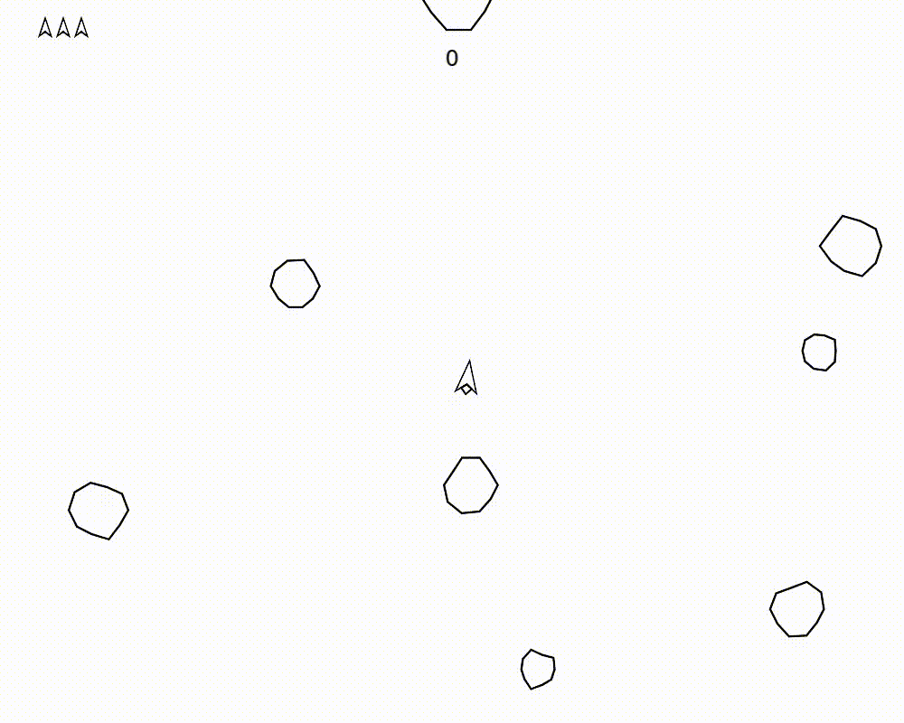

# Asteroids in Lua

This is a simple asteroids game written in Lua using the LÖVE framework.

## Demo

## How to run

1. Install LÖVE from [here](https://love2d.org/).
2. Clone this repository.
3. Run the game by executing `love .` in the root directory of the repository.

## Controls

- `W` to accelerate.
- `A` to rotate left.
- `D` to rotate right.
- `Space` to shoot.

## Image

[Image](assets/image.png)

